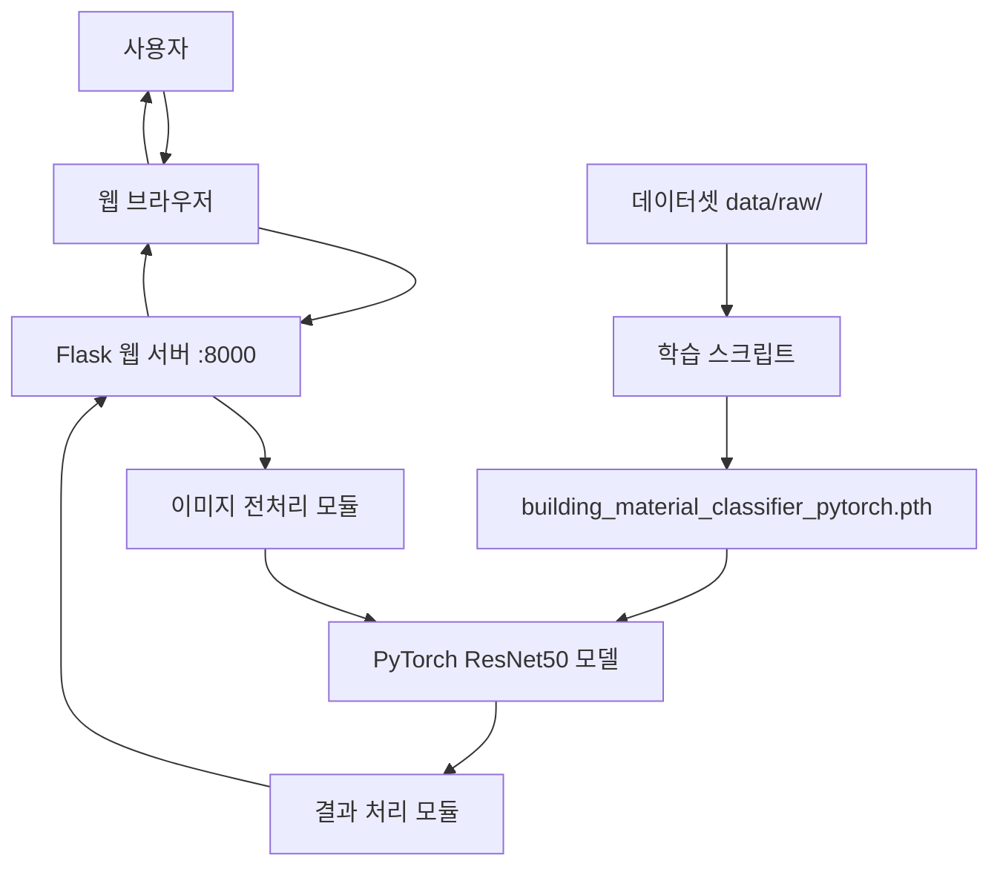

# 건축 외장 마감재 분류 웹 어플리케이션 설계 문서

## 개요

PyTorch ResNet50 전이학습 모델과 Flask 웹 프레임워크를 결합한 건축 외장재 자동 분류 시스템입니다. 931개의 이미지로 학습된 모델을 사용하여 5가지 외장재(brick, metal, stone, stucco, wood)를 분류합니다.

## 시스템 아키텍처

### 전체 시스템 구조



### 기술 스택

**백엔드:**
- **Python 3.11**: 메인 개발 언어
- **Flask**: 웹 프레임워크
- **PyTorch 2.0.1**: 딥러닝 프레임워크
- **torchvision 0.15.2**: 이미지 처리 및 전이학습 모델
- **Pillow**: 이미지 조작
- **NumPy**: 데이터 처리

**프론트엔드:**
- **HTML5/CSS3**: 기본 마크업 및 스타일링
- **JavaScript (ES6+)**: 클라이언트 사이드 로직
- **Bootstrap 5**: 반응형 UI 프레임워크

**모델:**
- **ResNet50**: 사전 훈련된 ImageNet 모델 기반
- **전이학습**: 마지막 FC 레이어만 재학습
- **입력 크기**: 224x224x3
- **출력**: 5개 클래스 (brick, metal, stone, stucco, wood)

## 컴포넌트 및 인터페이스

### 1. 데이터 관리 모듈

**목적**: 이미지 데이터셋 관리 및 재분류

**파일 구조:**
```
data/
└── raw/
    ├── brick/      (255개)
    ├── metal/      (192개)
    ├── stone/      (205개)
    ├── stucco/     (133개)
    └── wood/       (146개)
```

**주요 스크립트:**
- `reorganize_data.py`: 파일명 기반 데이터 재분류

### 2. PyTorch 모델 모듈

**목적**: ResNet50 기반 이미지 분류

**모델 아키텍처:**
```python
ResNet50 (사전 훈련)
├── conv1, bn1, relu, maxpool
├── layer1 (3 blocks)
├── layer2 (4 blocks)
├── layer3 (6 blocks)
├── layer4 (3 blocks)
├── avgpool
└── fc (수정됨)
    ├── Dropout(0.3)
    ├── Linear(2048 → 512)
    ├── ReLU
    ├── Dropout(0.2)
    └── Linear(512 → 5)
```

**학습 스크립트:**
- `train_pytorch_model.py`: 메인 학습 (ResNet50, 25 에포크)
- `train_fast_pytorch.py`: 빠른 학습 (ResNet18, 15 에포크)

**학습 설정:**
- Optimizer: Adam (lr=0.001)
- Loss: CrossEntropyLoss
- Scheduler: ReduceLROnPlateau
- 데이터 분할: 80% train, 20% validation
- 배치 크기: 32 (ResNet50), 64 (ResNet18)

### 3. 이미지 전처리 모듈

**파일**: `app/services/image_service.py`

**전처리 파이프라인:**
```python
1. RGB 변환 (RGBA → RGB)
2. 크기 조정 (비율 유지 + 패딩) → 224x224
3. 정규화 (0-255 → 0-1)
4. ImageNet 정규화
   - mean: [0.485, 0.456, 0.406]
   - std: [0.229, 0.224, 0.225]
5. 배치 차원 추가 (1, 224, 224, 3)
```

### 4. PyTorch 모델 서비스

**파일**: `app/services/model_service_pytorch.py`

**주요 기능:**
```python
class ModelService:
    def __init__(self, model_path: str)
    def load_model(self) -> bool
    def predict(self, image: np.ndarray) -> Dict[str, Any]
    def get_model_info(self) -> Dict[str, Any]
```

**예측 프로세스:**
1. NumPy (H,W,C) → PyTorch (C,H,W) 변환
2. 모델 추론 (forward pass)
3. Softmax 확률 계산
4. 결과 반환

### 5. Flask 웹 어플리케이션

**파일 구조:**
```
app/
├── __init__.py           # Flask 앱 팩토리
├── settings.py           # 설정
├── api/
│   ├── __init__.py
│   └── routes.py         # API 엔드포인트
├── main/
│   ├── __init__.py
│   └── routes.py         # 웹 페이지 라우트
├── services/
│   ├── image_service.py
│   └── model_service_pytorch.py
├── utils/
│   ├── validators.py
│   └── error_handler.py
└── middleware/
    └── security.py
```

**주요 API 엔드포인트:**
```python
GET  /                    # 메인 페이지
GET  /api/health          # 서버 상태 확인
POST /api/predict         # 이미지 업로드 분류
POST /api/predict-camera  # 카메라 이미지 분류
GET  /api/classes         # 클래스 정보
```

## 데이터 모델

### 모델 출력 형식

```json
{
    "success": true,
    "data": {
        "prediction": {
            "class": "brick",
            "confidence": 0.999,
            "probabilities": {
                "brick": 0.999,
                "metal": 0.001,
                "stone": 0.000,
                "stucco": 0.000,
                "wood": 0.000
            }
        },
        "description": {
            "name": "벽돌/조적",
            "description": "점토를 구워 만든 건축 자재로...",
            "characteristics": [...]
        },
        "processing_time": 0.234
    },
    "message": "이미지 분류가 완료되었습니다."
}
```

### 클래스 정보

```python
CLASS_NAMES = ['brick', 'metal', 'stone', 'stucco', 'wood']

CLASS_DESCRIPTIONS = {
    'brick': {
        'name': '벽돌/조적',
        'description': '점토를 구워 만든 건축 자재...',
        'characteristics': ['높은 내구성', '우수한 단열성', ...]
    },
    # ... 나머지 클래스
}
```

## 성능 지표

### 모델 성능 (검증 데이터 187개)

- **전체 정확도**: 67.9% (127/187)
- **클래스별 정확도**:
  - brick: 76.6% (36/47)
  - metal: 78.4% (29/37)
  - stone: 65.0% (26/40)
  - stucco: 75.0% (24/32)
  - wood: 38.7% (12/31)

### API 테스트 결과 (10개 샘플)

- **정확도**: 90.0% (9/10)
- **평균 신뢰도**: 0.85+
- **주요 오분류**: stone → wood (1건)

### 시스템 성능

- **모델 로딩 시간**: ~2초
- **이미지 전처리**: ~0.1초
- **모델 추론**: ~0.2초 (CPU)
- **총 응답 시간**: ~0.5초

## 오류 처리

### 주요 오류 유형

1. **파일 업로드 오류**
   - 파일 크기 초과 (10MB)
   - 지원하지 않는 형식
   - 손상된 이미지

2. **모델 추론 오류**
   - 모델 로드 실패
   - 메모리 부족
   - 전처리 실패

3. **시스템 오류**
   - 서버 과부하
   - 네트워크 오류

## 테스트 전략

### 테스트 스크립트

- `test_pytorch_model.py`: 모델 성능 평가
- `test_pytorch_api.py`: API 엔드포인트 테스트

### 테스트 항목

1. **모델 테스트**
   - 검증 데이터 정확도
   - 클래스별 성능
   - 혼동 행렬 분석

2. **API 테스트**
   - 이미지 업로드
   - 분류 결과 검증
   - 응답 시간 측정

## 배포 및 실행

### 로컬 실행

```bash
# 가상환경 활성화
.\venv_311\Scripts\Activate.ps1

# 서버 실행
python run.py
```

### 서버 설정

- **포트**: 8000
- **호스트**: 0.0.0.0 (모든 인터페이스)
- **디버그 모드**: development 환경에서 활성화

### 필수 파일

- `building_material_classifier_pytorch.pth`: 학습된 모델
- `requirements.txt`: Python 의존성
- `run.py`: 서버 실행 스크립트

## 향후 개선 방안

1. **모델 성능 개선**
   - 더 많은 데이터 수집 (특히 wood 클래스)
   - 데이터 증강 기법 적용
   - 더 긴 학습 (50+ 에포크)

2. **시스템 최적화**
   - 모델 양자화 (INT8)
   - ONNX 변환 (추론 속도 향상)
   - GPU 지원 추가

3. **기능 추가**
   - 배치 이미지 처리
   - 분류 히스토리 저장
   - 사용자 피드백 수집
