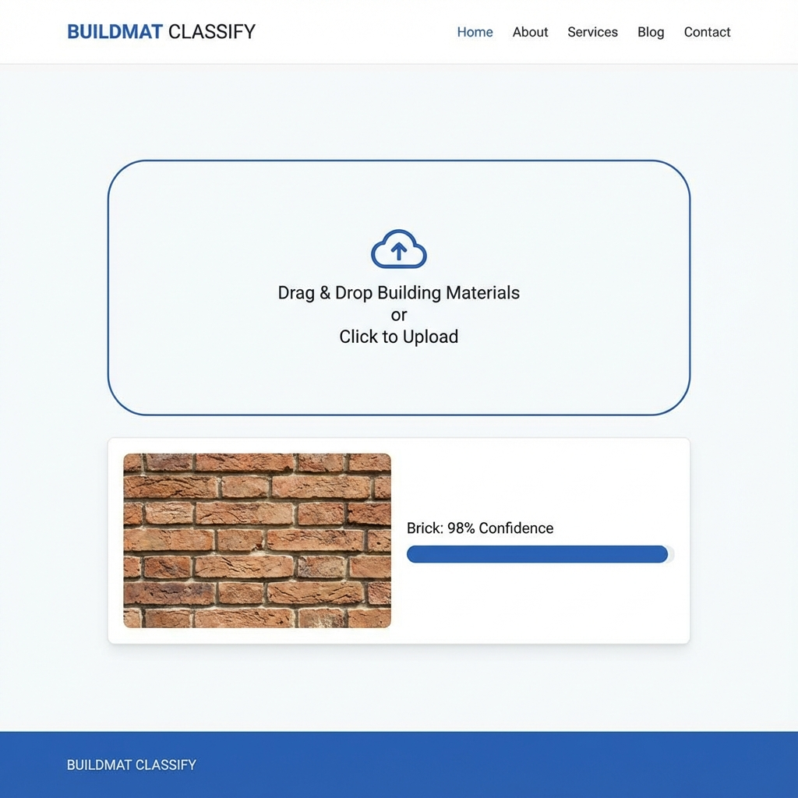
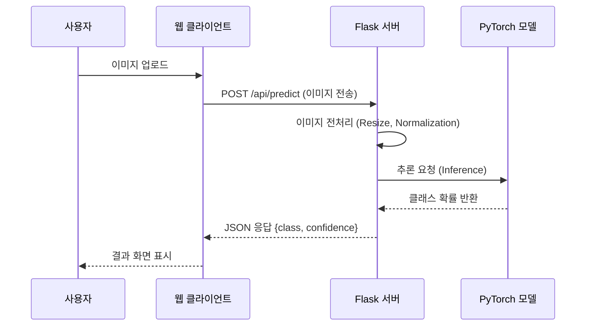

# 딥러닝 기반 건축 자재 분류 서비스 (Building Material Classifier)



## 프로젝트 소개
**딥러닝 기반 건축 자재 분류 서비스**는 사용자가 업로드한 이미지를 분석하여 벽돌, 콘크리트, 유리 등 건축 자재의 종류를 자동으로 식별하고 알려주는 AI 솔루션입니다. 건설 현장 및 관련 산업에서의 업무 효율성을 증대하고 자재 분류 자동화에 기여하기 위해 개발되었습니다.

ResNet18 모델을 기반으로 한 딥러닝 엔진이 탑재되어 있으며, 웹 인터페이스를 통해 누구나 쉽게 사용할 수 있습니다.

## 주요 기능
*   **이미지 업로드**: 드래그 앤 드롭 또는 파일 선택을 통해 간편하게 이미지 업로드
*   **실시간 AI 분석**: 업로드 즉시 서버의 딥러닝 모델이 자재를 분석
*   **정확한 분류 결과**: 자재의 종류(클래스)와 예측 신뢰도(Confidence) 제공
*   **반응형 웹 디자인**: 데스크탑 및 모바일 환경 최적화

## 기술 스택 (Tech Stack)

| Category | Technology |
|----------|------------|
| **Backend** | Python 3, Flask 3.0 |
| **AI / ML** | PyTorch 2.0, Torchvision (ResNet18) |
| **Frontend** | HTML5, CSS3, Vanilla JavaScript |
| **Server** | Nginx, Gunicorn |
| **Deployment** | Docker (Optional), Shell Script |

## 시스템 아키텍처 (System Architecture)

### 애플리케이션 추론 흐름 (Inference Flow)



### 서버 아키텍처

```mermaid
graph LR
    Client[Client Browser] -->|HTTP| Nginx[Nginx Web Server]
    Nginx -->|Reverse Proxy| Gunicorn[Gunicorn WSGI]
    Gunicorn -->|Manage| Flask[Flask App]
    Flask -->|Load| Model[PyTorch Model (.pth)]
```

## 프로젝트 구조 (Project Structure)

```bash
picture_machine
 ┣ app
 ┃ ┣ api               # REST API 블루프린트
 ┃ ┣ main              # 메인 웹 페이지 블루프린트
 ┃ ┣ services          # 비즈니스 로직 (ImageService, ModelService)
 ┃ ┣ middleware        # 보안 미들웨어 등
 ┃ ┗ __init__.py       # 앱 팩토리
 ┣ models              # 학습된 모델 디렉토리
 ┣ static              # 정적 파일 (CSS, JS, Images)
 ┣ templates           # HTML 템플릿
 ┣ building_material_classifier_pytorch.pth  # 학습 모델 파일
 ┣ requirements.txt    # 의존성 목록
 ┗ run.py              # 실행 스크립트
```

## 설치 및 실행 방법 (Getting Started)

### 1. 전제 조건 (Prerequisites)
*   Python 3.8 이상
*   pip (Python Package Installer)

### 2. 설치 (Installation)

```bash
# 1. 저장소 클론
git clone https://github.com/your-repo/building-material-classifier.git
cd building-material-classifier

# 2. 가상환경 생성 및 활성화
# 가상환경 생성
python -m venv venv

# 가상환경 활성화 (Windows - CMD)
.\venv\Scripts\activate

# 가상환경 활성화 (Windows - PowerShell)
.\venv\Scripts\Activate.ps1
# (만약 보안 오류가 발생하면 아래 명령어 실행 후 다시 시도)
# Set-ExecutionPolicy -ExecutionPolicy RemoteSigned -Scope CurrentUser

# 가상환경 활성화 (Mac/Linux)
source venv/bin/activate

# 3. 의존성 설치
python -m pip install --upgrade pip
pip install -r requirements.txt
```

### 3. 실행 (Running)

**개발 모드 실행:**
```bash
python run.py
```
브라우저에서 `http://localhost:8000` 접속

**프로덕션 모드 실행 (Gunicorn):**
```bash
# Windows에서는 waitress 등을 사용하거나 WSL 권장, Linux 환경일 경우:
gunicorn -c gunicorn_config.py "app:create_app()"
```